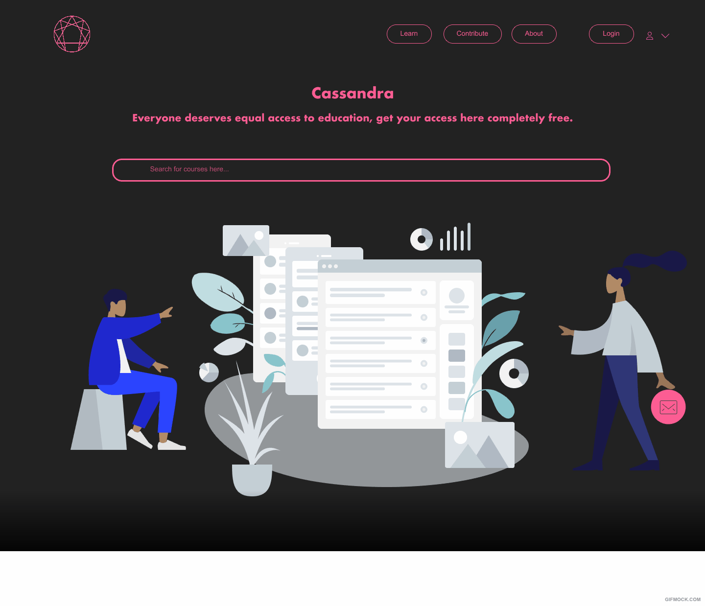
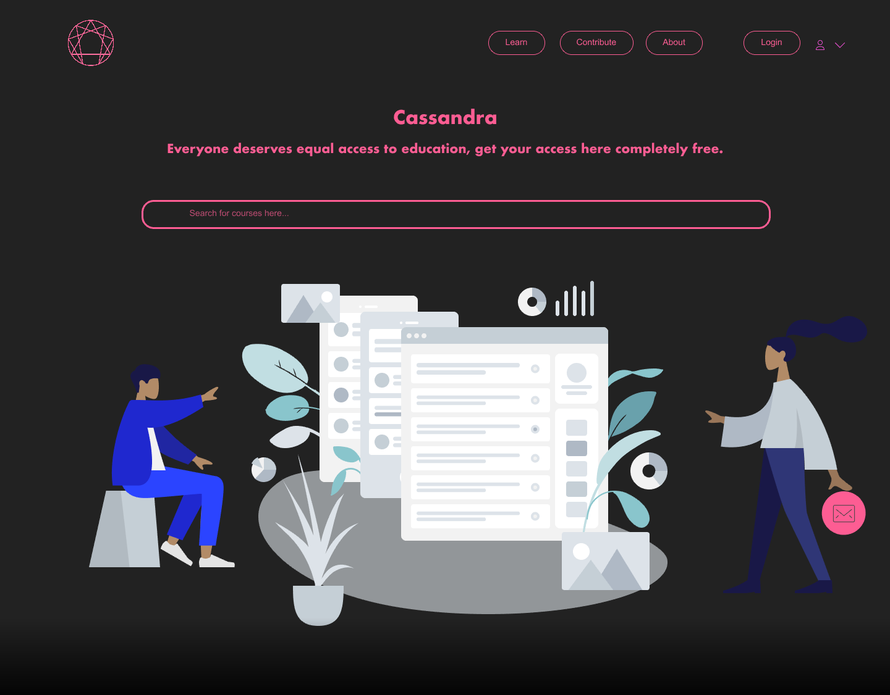
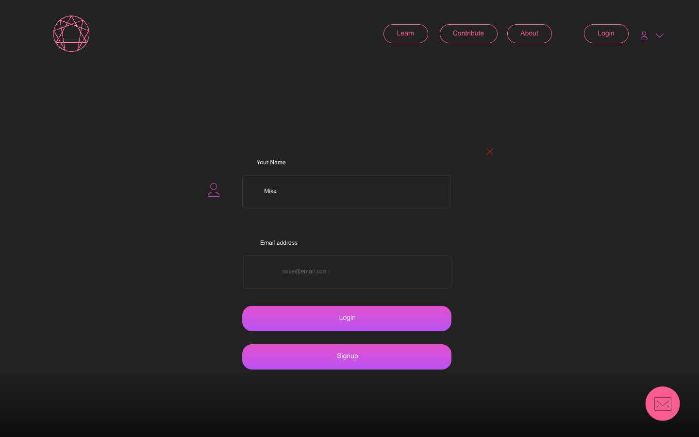
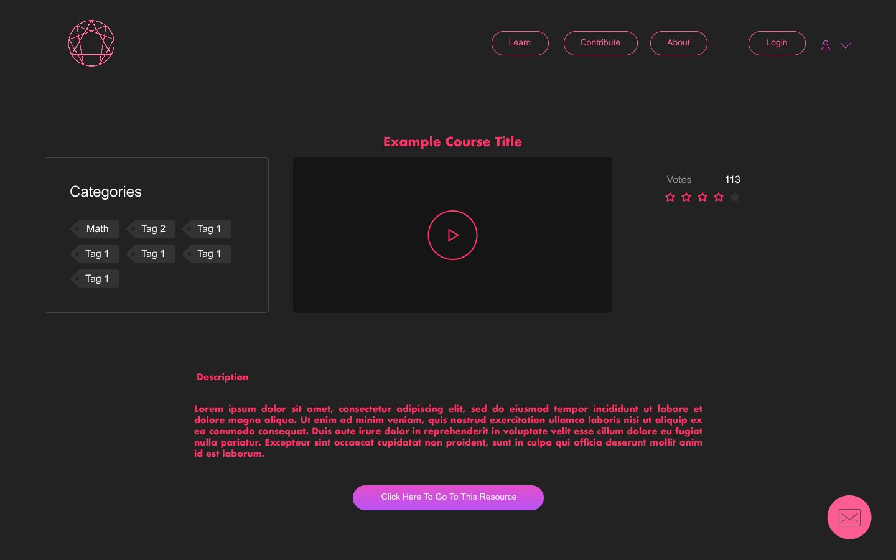
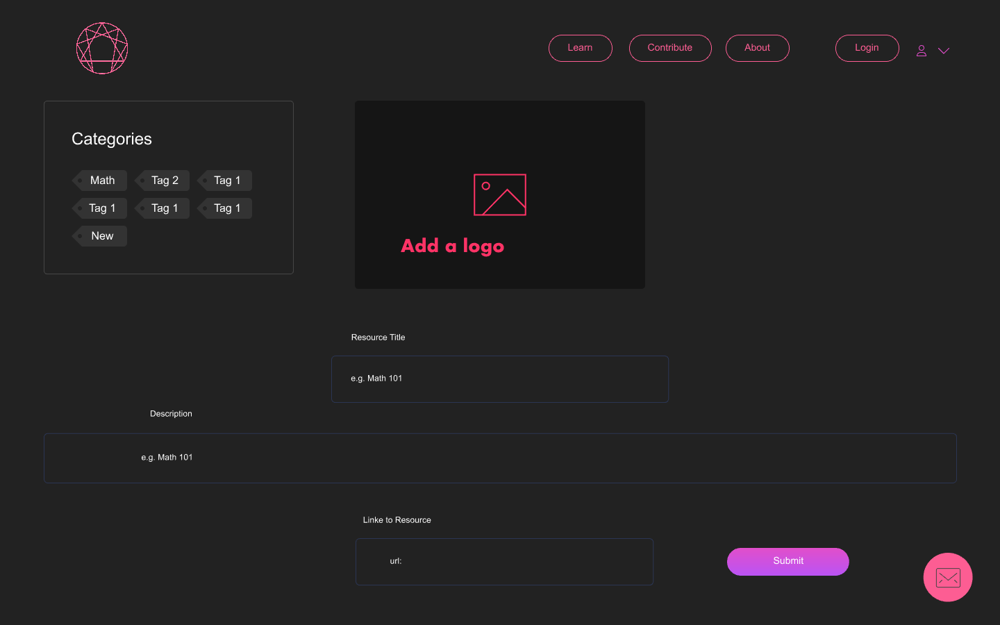
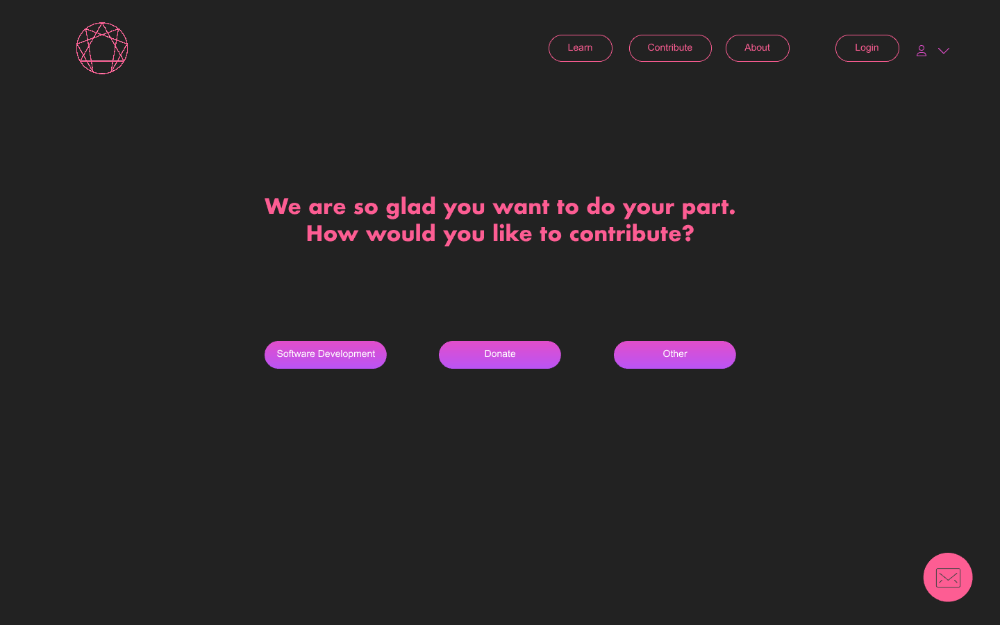
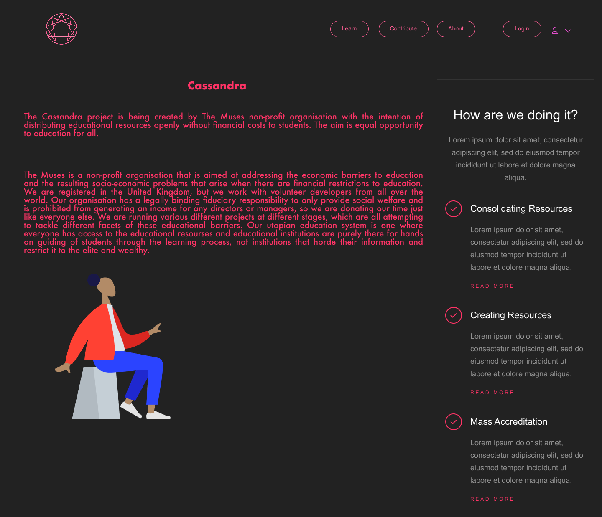

# Wire Frames

## Wire Frames

We currently only have a preliminary draft of our platforms wire frames, but our talented designers are busy putting together the real thing. 


This is currently only a general design and flow guide and is not the intended final outcome of the platform.


```
InVision Prototype: https://projects.invisionapp.com/prototype/Cassandra-External-Resources-Draft-1-ck3ridt93004nga01cjpceeh7/play/5cb2f2eb
*Note: there are currently bugs in the prototype
```




This design is currently only stage one of the development process \(External Resources\) which will be part of the first launch of Cassandra. 


## Splash Page

This is the entry point and landing page of the platform, with a simple search bar to find the resources you are looking for.



## Authentication Pages

Signup and Login pages for users who want to contribute or post resources.



## External Resources Pages

We currently only have a preliminary draft of our platforms wire frames, but our talented designers are busy putting together the real thing. 


**Resources Page:**

This page allows the user to search through and efficiently filter resources to find their desired educational needs.


Features: 

* Searchbar for filtering resources
* Categories breakdown for filtering resources
* Add new Resources button takes user to section where they can create a new external resource.
* Clicking on a resource takes the user to a detailed page on that resource.
* Voting and rating out of 10 enables users to identify good quality resources.


**Resource Viewing Page:**

This page allows you to either watch the course on the Cassandra platform or redirect you to the source of the resource.




**Adding Resource Page:**

This page allows authenticated users to create new external resources to add to the Cassandra catalogue.



## Contribution Pages

Here, the users are able to pick multiple ways of contributing to The Muses and Cassandra to help the drive to make equal access to education a reality. 




## About Page

A brief description of Cassandra and how we are making equal access to education a reality.



